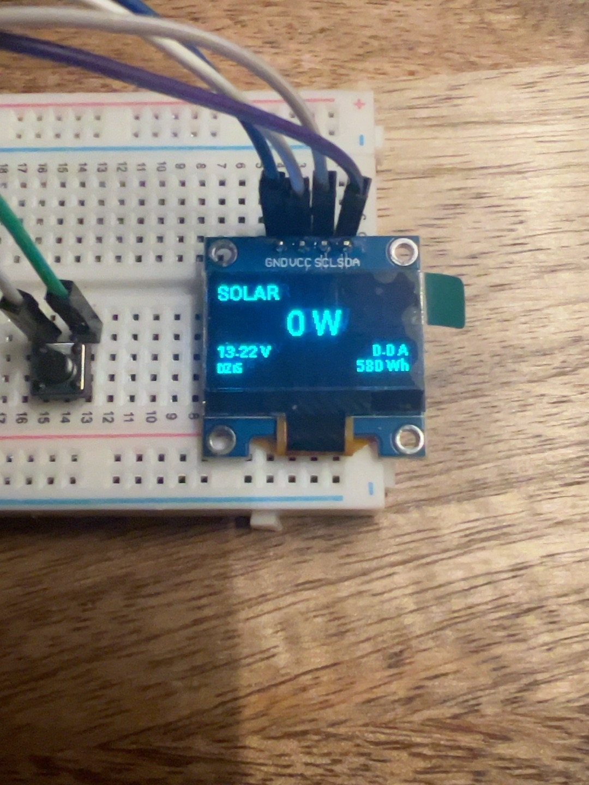
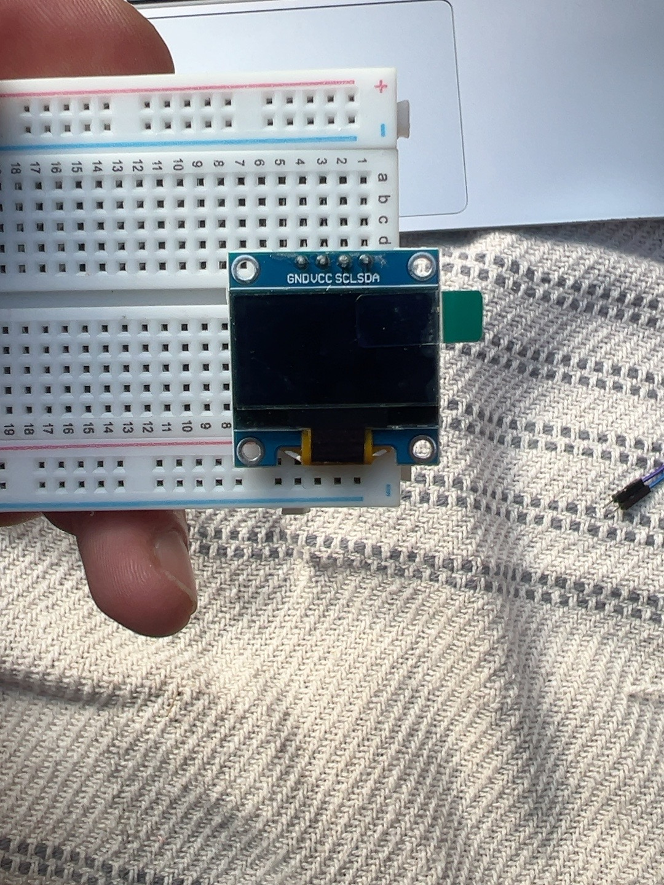
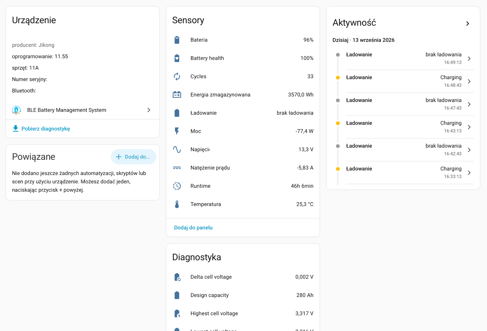
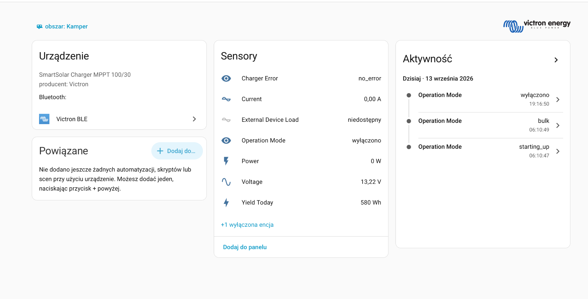

# ESP32 BMS & Solar Display for Home Assistant

Niewielki panel informacyjny do kampera oparty na **ESP32 C3 SuperMini** i monochromatycznym OLEDzie **SSD1306 128×64**. Wyświetlacz pobiera dane z Home Assistant przez natywne API ESPHome i automatycznie przełącza widok między akumulatorem a regulatorem solarnym.



## Najważniejsze funkcje

* dwa automatycznie przełączane widoki: `AKUMULATOR` i `SOLAR`
* zmiana ekranu co 6 sekund
* odświeżanie parametrów co 1 sekundę
* szybka animacja przejścia między ekranami
* pasek stanu naładowania akumulatora
* integracja z dowolnymi sensorami Home Assistant przez ESPHome
* brak bezpośredniego połączenia ESP32 z BMS lub Victronem

## Jak to działa

```text
BMS ──Bluetooth──┐
                 │
Victron ─────────┼──> Home Assistant ──WiFi / ESPHome API──> ESP32 C3 ──I2C──> OLED
                 │
                 └── wszystkie dane są zbierane w jednym miejscu
```

ESP32 nie zajmuje połączenia Bluetooth BMS. Home Assistant odczytuje BMS i Victrona, a ESP32 pobiera tylko gotowe wartości sensorów przez sieć WiFi.

## Podgląd

### Sprzęt



### Home Assistant

| BMS | Victron SmartSolar |
|---|---|
|  |  |

## Wymagane komponenty

* ESP32 C3 SuperMini
* OLED SSD1306 128×64 z interfejsem I2C
* cztery przewody połączeniowe
* przewód USB C do pierwszego programowania
* Home Assistant
* ESPHome
* źródła danych w Home Assistant, np. BMS i Victron SmartSolar

## Połączenie OLED

| OLED | ESP32 C3 SuperMini |
|---|---|
| `GND` | `GND` / `G` |
| `VCC` | `3.3V` |
| `SCL` | `GPIO3` |
| `SDA` | `GPIO4` |

OLED jest zasilany bezpośrednio z pinu 3.3 V ESP32.

```yaml
i2c:
  sda: GPIO4
  scl: GPIO3
  scan: true
```

## Wymagane encje Home Assistant

Domyślna konfiguracja wykorzystuje poniższe encje.

### Akumulator

```text
sensor.12v280_bateria
sensor.12v280_napiecie
sensor.12v280_natezenie_pradu
sensor.12v280_moc
sensor.12v280_temperatura
sensor.12v280_delta_voltage
```

### Victron SmartSolar

```text
sensor.smartsolarkamp_current
sensor.smartsolarkamp_power
sensor.smartsolarkamp_voltage
sensor.smartsolarkamp_yield_today
```

Jeżeli Twoje encje mają inne identyfikatory, zmień odpowiednie wartości `entity_id` w `bms-display.yaml`.

> **Uwaga:** `sensor.smartsolarkamp_voltage` może w zależności od integracji oznaczać napięcie po stronie akumulatora, a nie rzeczywiste napięcie paneli PV. Jeśli Home Assistant udostępnia osobną encję napięcia PV, warto podmienić ją w konfiguracji.

## Konfiguracja WiFi

Dane dostępowe nie są zapisane w repozytorium.

Skopiuj plik przykładowy:

```bash
cp secrets.example.yaml secrets.yaml
```

Następnie edytuj `secrets.yaml`:

```yaml
wifi_ssid: "YOUR_WIFI_SSID"
wifi_password: "YOUR_WIFI_PASSWORD"
```

`secrets.yaml` znajduje się w `.gitignore`, więc nie powinien trafić do GitHuba.

## Instalacja ESPHome na macOS

```bash
python3 -m pip install esphome
```

Sprawdzenie wersji:

```bash
esphome version
```

Projekt był używany z ESPHome `2026.8.2`.

## Wgrywanie firmware

Przejdź do katalogu projektu:

```bash
cd /Users/tadzik/Desktop/ESPHome
```

Uruchom:

```bash
esphome run bms-display.yaml
```

Przy pierwszej instalacji najlepiej wybrać port USB podobny do:

```text
/dev/cu.usbmodem1101
```

Po pierwszym wgraniu można korzystać z OTA.

```bash
esphome run bms-display.yaml --device 192.168.1.110
```

Adres IP oczywiście może być inny w Twojej sieci.

## Diagnostyka OTA

Sprawdzenie dostępności ESP32:

```bash
ping 192.168.1.110
```

ESPHome API:

```bash
nc -vz 192.168.1.110 6053
```

OTA:

```bash
nc -vz 192.168.1.110 3232
```

Logi ESPHome:

```bash
esphome logs bms-display.yaml --device 192.168.1.110
```

Jeżeli pojawia się `No route to host`, warto sprawdzić aktywne VPNy, ZeroTier lub inne interfejsy sieciowe. Na macOS trasę można podejrzeć poleceniem:

```bash
route -n get 192.168.1.110
```

W razie problemów firmware zawsze można wgrać ponownie przez USB.

## Wygląd ekranów

### Akumulator

```text
AKUMULATOR       96%
██████████████████

13.27 V       -5.8 A

77 W          25.3 C
```

### Solar

```text
SOLAR

13.22 V       20.8 A

287 W     Dzis 580 Wh
```

## Raspberry Pi 3 i Home Assistant

Projekt był uruchamiany z Home Assistant na Raspberry Pi 3 64 bit z 1 GB RAM.

Kompilowanie ESPHome bezpośrednio na takim Raspberry Pi może mocno obciążyć system. Jeśli Home Assistant przestaje odpowiadać podczas kompilacji, praktyczniejszym rozwiązaniem jest kompilowanie firmware na Macu lub PC i używanie Raspberry Pi tylko jako serwera Home Assistant.

Jeżeli w logach pojawia się:

```text
Under-voltage was detected
```

należy sprawdzić zasilacz, przewód USB oraz przetwornicę 12 V → 5 V. W instalacji kamperowej spadki napięcia mogą prowadzić do restartów Raspberry Pi i problemów z bazą Home Assistant.

## Struktura repozytorium

```text
esp32-bms-solar-display/
├── assets/
│   ├── display.jpg
│   ├── hardware.jpg
│   ├── home-assistant-bms.png
│   └── home-assistant-solar.png
├── .gitignore
├── bms-display.yaml
├── LICENSE
├── README.md
└── secrets.example.yaml
```

## Dostosowanie projektu

Najczęściej zmieniane elementy:

* `entity_id` sensorów Home Assistant
* czas przełączania ekranów w `interval: 6s`
* częstotliwość odświeżania w `interval: 1s`
* piny I2C
* układ i rozmiary czcionek
* rodzaj animacji między ekranami

## Bezpieczeństwo

Nie publikuj w repozytorium:

* hasła WiFi
* tokenów Home Assistant
* kluczy API
* prywatnych sekretów ESPHome
* pliku `secrets.yaml`

## Licencja

Projekt udostępniony na licencji MIT. Szczegóły znajdują się w pliku [LICENSE](LICENSE).
